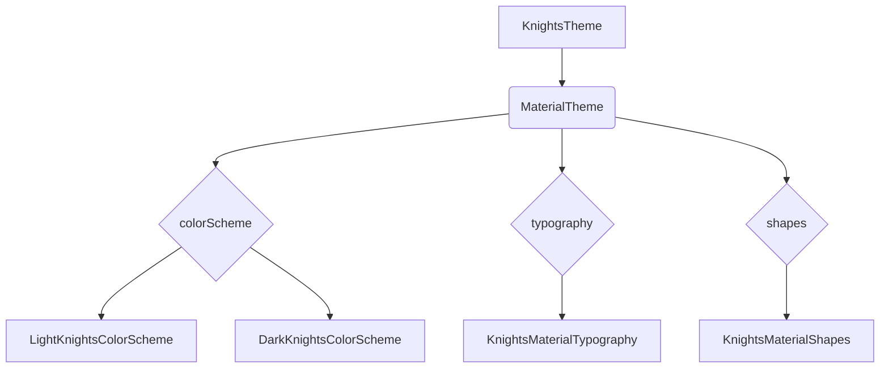

# OpenKnights Design System UI Design Specification

## 1. UI 요구사항
OpenKnights 앱의 일관된 디자인을 위해 Material 3 디자인 시스템을 기반으로 하는 커스텀 테마 `KnightsTheme`를 정의합니다. 이 테마는 색상, 타이포그래피, 도형을 포함하며, Jetpack Compose의 `MaterialTheme` 컴포저블을 통해 앱 전체에 적용됩니다.

## 2. UI 구조 개요 (Mermaid Diagram)


## 3. 주요 컴포저블 설명

### KnightsTheme
`KnightsTheme`는 OpenKnights 앱의 최상위 테마 컴포저블입니다. `androidx.compose.material3.MaterialTheme`를 래핑하여 앱의 전반적인 디자인을 설정합니다.

- **`useDarkTheme: Boolean`**: 시스템 설정 또는 사용자 선택에 따라 다크 모드 적용 여부를 결정합니다.
- **`content: @Composable () -> Unit`**: 테마가 적용될 UI 콘텐츠를 정의합니다.

`KnightsTheme` 내부에서는 `useDarkTheme` 값에 따라 `LightKnightsColorScheme` 또는 `DarkKnightsColorScheme`를 선택하여 `MaterialTheme`의 `colorScheme` 인자로 전달합니다. 또한, `KnightsMaterialTypography`를 `typography` 인자로, `KnightsMaterialShapes`를 `shapes` 인자로 전달하여 앱의 시각적 스타일을 통합합니다.

### Color Scheme (`KnightsColor.kt` 및 `KnightsColorScheme.kt`)
앱의 색상 팔레트는 `KnightsColor.kt`에 정의된 커스텀 색상들과 `KnightsColorScheme.kt`에 정의된 `LightKnightsColorScheme`, `DarkKnightsColorScheme`를 통해 관리됩니다.

- **`KnightsColor`**: 앱에서 사용될 고유한 색상들을 `Color` 객체로 정의합니다. (예: `Purple`, `White`, `Blue` 등)
- **`LightKnightsColorScheme`**: 밝은 테마에서 사용될 `ColorScheme`를 정의합니다. `lightColorScheme` 빌더 함수를 사용하여 `KnightsColor`의 색상들을 `primary`, `secondary`, `background` 등 Material 3의 표준 색상 역할에 매핑합니다.
- **`DarkKnightsColorScheme`**: 어두운 테마에서 사용될 `ColorScheme`를 정의합니다. `darkColorScheme` 빌더 함수를 사용하여 `KnightsColor`의 색상들을 Material 3의 표준 색상 역할에 매핑합니다.

### Typography (`KnightsType.kt`)
앱의 텍스트 스타일은 `KnightsType.kt`에서 정의됩니다.

- **`SansSerifStyle`**: 기본 텍스트 스타일을 정의합니다.
- **`KnightsTypography`**: 앱에서 사용될 다양한 텍스트 스타일(예: `displayLargeR`, `headlineLargeEB`, `bodyLargeR` 등)을 `TextStyle` 객체로 정의하는 커스텀 데이터 클래스입니다.
- **`KnightsMaterialTypography`**: `KnightsTypography`에 정의된 커스텀 텍스트 스타일들을 `androidx.compose.material3.Typography`의 표준 텍스트 스타일에 매핑하여 `MaterialTheme`에 전달될 수 있도록 합니다. (예: `displayLarge`에 `KnightsTypography.displayLargeR` 매핑)

### Shapes (`KnightsShape.kt`)
앱의 컴포넌트 모양은 `KnightsShape.kt`에서 정의됩니다.

- **`KnightsShape`**: 앱에서 사용될 커스텀 도형(예: `chip`, `rounded12` 등)을 `Shape` 객체로 정의하는 데이터 클래스입니다.
- **`KnightsMaterialShapes`**: `KnightsShape`에 정의된 커스텀 도형들을 `androidx.compose.material3.Shapes`의 표준 도형(예: `small`, `medium`, `large`)에 매핑하여 `MaterialTheme`에 전달될 수 있도록 합니다.

## 4. Component

### BottomLogo (`BottomLogo.kt`)
앱 하단에 표시되는 로고 컴포넌트입니다. 텍스트를 인자로 받아 표시할 수 있습니다.

### KnightsCard (`Card.kt`)
Material 3의 `Card` 컴포넌트를 래핑한 커스텀 카드 컴포넌트입니다. 내부에 어떤 Composable이든 포함할 수 있는 슬롯을 제공합니다.

### IconTextChip (`IconTextChip.kt`)
아이콘과 텍스트를 함께 표시하는 작은 칩 형태의 컴포넌트입니다. 배경색, 텍스트 색상, 아이콘, 아이콘 색상 등을 설정할 수 있습니다.

### OpenTopBar.kt
 `OpenTopBarPreview_Back`: 뒤로가기 아이콘이 포함된 상단 바의 미리보기입니다.
 `OpenTopBarPreview_CloseAndAction`: 닫기 아이콘과 저장 액션 아이콘이 포함된 상단 바 미리보기입니다. 
 
 
 
## 5. 미리보기(Preview) 설명
`DesignSystemDemo.kt` 파일에서 `KnightsTheme`가 적용된 UI 컴포넌트의 미리보기를 제공합니다.

- **`DesignSystemDemoPreviewLight`**: `KnightsTheme(useDarkTheme = false)`를 사용하여 밝은 테마가 적용된 `DesignSystemDemo` 컴포저블을 미리보기합니다.
- **`DesignSystemDemoPreviewDark`**: `KnightsTheme(useDarkTheme = true)`를 사용하여 어두운 테마가 적용된 `DesignSystemDemo` 컴포저블을 미리보기합니다.

## 6. 라이브러리 모듈에서 Compose 프리뷰를 위한 Gradle 설정

라이브러리 모듈에서 Jetpack Compose를 사용하여 UI 컴포넌트를 개발하고 미리보기를 사용하려면, 해당 모듈의 `build.gradle.kts` 파일에 다음 설정이 필요합니다.

```kotlin
plugins {
    // Android Library 플러그인
    alias(libs.plugins.android.library)
    // Kotlin Android 플러그인
    alias(libs.plugins.kotlin.android)
    // Kotlin Compose 컴파일러 플러그인 (Kotlin 2.0 이상에서 필수)
    alias(libs.plugins.kotlin.compose)
}

android {
    // ... (기존 설정 유지) ...

    buildFeatures {
        // Compose 사용을 활성화합니다.
        compose = true
    }

    // ... (기존 설정 유지) ...

    // Compose 컴파일러 옵션 (선택 사항, 필요에 따라 추가)
    // kotlinOptions {
    //     freeCompilerArgs += listOf(
    //         "-P",
    //         "plugin:androidx.compose.compiler.plugins.kotlin:metricsDestination=$project.buildDir/compose_metrics"
    //     )
    //     freeCompilerArgs += listOf(
    //         "-P",
    //         "plugin:androidx.compose.compiler.plugins.kotlin:reportsDestination=$project.buildDir/compose_reports"
    //     )
    // }
}

dependencies {
    // ... (기존 종속성 유지) ...

    // Compose Bill of Materials (BOM)을 사용하여 Compose 라이브러리 버전 일관성 유지
    implementation(platform(libs.androidx.compose.bom))

    // Compose UI 기본 라이브러리
    implementation(libs.androidx.ui)
    // Compose UI 그래픽 라이브러리
    implementation(libs.androidx.ui.graphics)
    // Compose UI 툴링 미리보기 (Preview) 라이브러리
    implementation(libs.androidx.ui.tooling.preview)
    // Compose UI 툴링 (디버그 빌드에서만 사용)
    debugImplementation(libs.androidx.ui.tooling)
    // Material 3 디자인 시스템 라이브러리
    implementation(libs.androidx.material3)

    // ... (기존 종속성 유지) ...
}
```

**설명:**

-   **`plugins { alias(libs.plugins.kotlin.compose) }`**: Kotlin 2.0부터는 Compose를 사용하는 모든 모듈에 `org.jetbrains.kotlin.plugin.compose` 플러그인을 명시적으로 적용해야 합니다. `libs.versions.toml` 파일에 `kotlin-compose` 플러그인이 정의되어 있어야 합니다.
-   **`buildFeatures { compose = true }`**: 이 설정은 Gradle에게 해당 모듈이 Compose를 사용하며, Compose 컴파일러를 적용해야 함을 알려줍니다.
-   **`implementation(platform(libs.androidx.compose.bom))`**: Compose BOM(Bill of Materials)을 사용하면 모든 Compose 라이브러리의 버전을 개별적으로 관리할 필요 없이, BOM의 버전에 따라 일관된 Compose 라이브러리 버전을 사용할 수 있습니다.
-   **`implementation(libs.androidx.ui)`**: Compose UI의 핵심 기능을 제공합니다.
-   **`implementation(libs.androidx.ui.graphics)`**: Compose UI의 그래픽 관련 기능을 제공합니다.
-   **`implementation(libs.androidx.ui.tooling.preview)`**: `@Preview` 어노테이션을 사용하여 컴포저블을 미리보기할 수 있도록 하는 라이브러리입니다.
-   **`debugImplementation(libs.androidx.ui.tooling)`**: Android Studio의 미리보기 패널에서 컴포저블을 렌더링하고 상호작용하는 데 필요한 툴링 기능을 제공합니다. `debugImplementation`으로 설정하여 릴리스 빌드에는 포함되지 않도록 합니다.
-   **`implementation(libs.androidx.material3)`**: Material Design 3 컴포넌트들을 제공합니다.

이러한 설정을 통해 라이브러리 모듈에서도 Compose 컴포넌트를 개발하고 미리보기를 통해 쉽게 확인할 수 있습니다.
